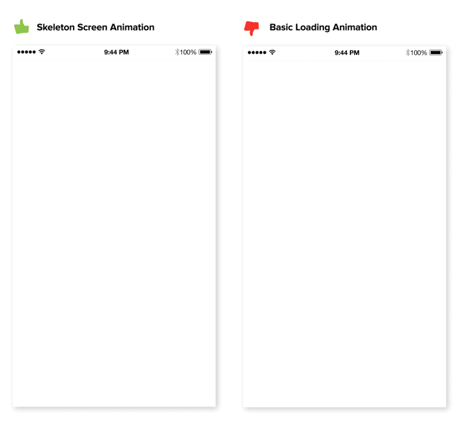

# 用户体验14条军规-进度条与骨架屏

> 设计不是为了好看，而是用来解决问题，好看与否本身也是问题的一种。乔布斯

## 从历史中走来

在遥远的上古时代，`Web` 还停留在刀耕火种的时期，人们对它的印象停留在 `页面` 阶段，前端开发自然是页面仔的工作内容。

随着时代的发展，特别是 `SPA` 单页应用的风靡，人类的审美欲望驱使着它朝着 `应用程序` 方向发展。B/S 架构下随着网速提升和H5/CSS3等技术的突飞猛进，`Web` 应用越发接近面向操作系统的原生应用，所以很多设计元素和理念都继承自原生应用。

## 诞生

`Skeleton Screen` 这个概念最早出自 `Google` 产品总监，《Web表单设计》作者，Luke Wroblewski 于 2013年9月17日 发表的博文《Mobile Design Details: Avoid The Spinner》里。（博文地址：http://www.lukew.com/ff/entry.asp?1797）

## 国内发展

目前国内有简书、领英、新浪微博头条文章页采用这个加载方案。国外有Facebook iOS版、Medium、WordPress App、Slack 等产品采用。相信以后会有更多的 App 和网页会使用 Skeleton Screen。

